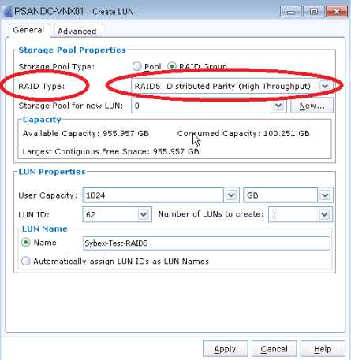
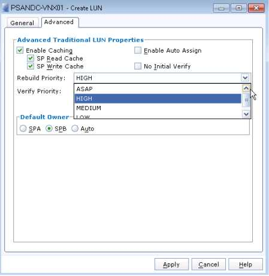

# 1.История и предпосылки RAID
Раньше в больших дорогих компьютерах устанавливался ***один большой дорогой диск single, large, expensive drive(SLED)***. 

Эти дисководы:
- Были очень дорогими
- Создавал единую точку отказа (SPOF)
- Имели ограниченные IOPS

RAID был изобретен для преодоления всех этих факторов.

# 2. Что такое RAID?
RAID — это аббревиатура. Раньше это означало избыточный массив недорогих дисков ***redundant array of inexpensive disks***. В настоящее время большинство людей называют его избыточным массивом независимых дисков ***redundant array of independent disks***. И с появлением твердотельных накопителей, которые на самом деле не являются дисками, возможно, он вот-вот увидит еще одно изменение и станет избыточным массивом независимых хранилищ ***redundant array of independent drives***.

В любом случае, смысл существования технологии RAID в современном мире ИТ двоякий:
- Защитите свои данные от неисправных дисков.
- Повысьте производительность ввода-вывода за счет распараллеливания ввода-вывода на нескольких дисках.

Для обеспечения повышенной производительности и защиты технология RAID объединяет несколько физических дисков и создает один или несколько логических дисков, которые охватывают эти несколько физических дисков, как показано на рисунке.

Логический диск обычно может быть одним из двух. Он может быть подмножеством одного физического диска с намерением создания нескольких логических дисков — иногда называемых разделами — из одного физического диска.

 Или, как в случае на рисунке, логический диск может быть устройством, созданным из емкости, которая агрегирована из нескольких физических дисков.
 
 На рисунке показан один логический диск, созданный из емкости четырех физических дисков. Иногда логический диск может называться:
 - логическим диском ***logical disk***
 - логическим томом ***logical volume***
 - виртуальным диском ***virtual disk***
 - виртуальным томом ***virtual volume***

Несколько уровней RAID, например:
- RAID 1, 
- RAID 10, 
- RAID 5
- RAID 6
каждый из которых имеет свои сильные и слабые стороны. 

В этой главе вы подробно рассмотрите наиболее популярные уровни RAID и рассмотрите их сильные и слабые стороны, а также потенциальные варианты использования. Однако, прежде чем более подробно рассмотреть уровни RAID, давайте сначала рассмотрим некоторые фундаментальные концепции и компоненты.

# 3. Аппаратный или программный RAID
RAID может быть реализован программно или аппаратно.

## 3.1 Программный RAID
Программный RAID обычно реализуется как часть ОС, поверх ОС с помощью логического менеджера томов, такого как ***Linux LVM***, или как часть файловой системы, как в случае с ***ZFS***. 

1. В любом случае это приводит к ***программному RAID, использующему ресурсы хоста***, такие как ЦП и ОЗУ. Это не такая большая проблема, как раньше, благодаря огромным ЦП и куче ОЗУ, которые мы обычно видим на серверах в наши дни. Потребление ресурсов хоста не является большой проблемой при реализации зеркалирования RAID 1, но может стать ***большей проблемой при выполнении RAID с контролем четности, такого как RAID 5 или RAID 6***, особенно если у вас много дисков в наборе RAID. 

2. Кроме того, поскольку ОС должна быть загружена до того, как программное обеспечение RAID сможет инициализироваться , ***загрузочные тома ОС не могут быть защищены RAID с помощью программного RAID***. 

3. Добавьте к этому отсутствие некоторых дополнительных преимуществ, которые обычно идут с аппаратным RAID, таких как ***более высокая производительность записи*** и ***более быстрое восстановление***, и программный RAID быстро начнет выглядеть как RAID для бедняков.

### 3.1.1 Microsoft Storage Spaces
Пространства хранения данных (Microsoft) В операционной системе Windows Server 2012 компания Microsoft реализовала LVM, известную как пространства хранения данных ***Storage Spaces***.

Storage Spaces позволяет объединять разнородные диски и создавать виртуальные тома , известные как storage spaces , используя емкость этих пулов. Эти storage spaces могут быть опционально защищены программным RAID — либо зеркально защищенными (RAID 1), либо защищенными четностью (RAID 5).

Хотя Storage Spaces — это относительно недавняя попытка предоставить расширенные функции хранения в программном обеспечении ОС, ее реализация программного RAID все еще страдает от накладных расходов в  производительности, которые испытывают другие программные RAID-решения, когда дело доходит до использования четности для защиты. 

Кроме того, Storage Spaces не предлагает никакой продвинутой интеграции файловой системы и программного RAID, как ZFS.

Хотя аспекты объединения в Storage Spaces могут быть хороши, программная реализация RAID является базовой и не смогла достичь космической скорости, оставаясь привязанной к тем же ограничениям производительности и использования, которые характерны для многих других реализаций программного RAID.

## 3.2 Аппаратный RAID
Аппаратный RAID, с другой стороны, предполагает наличие физического RAID-контроллера, реализованного в серверном оборудовании — на материнской плате или в виде карты расширения — который имеет собственный выделенный ЦП и кэш оперативной памяти с резервным питанием от батареи или флэш-памяти.

Благодаря этому выделенному оборудованию на центральном процессоре хоста не возникает никаких дополнительных расходов RAID. Кроме того, поскольку аппаратные RAID-контроллеры инициализируются до ОС, это означает, что загрузочные тома могут быть защищены RAID. Резервный или флэш-кэш на RAID-контроллере также обеспечивает улучшенную производительность записи с помощью кэширования с обратной записью — подтверждая ввод-вывод обратно хосту, когда он поступает в кэш, а не ожидая, пока он будет записан на диски в наборе RAID. 

Одним из потенциальных недостатков аппаратных RAID-контроллеров внутри серверов является то, что они обеспечивают SPOF. Потеряйте RAID-контроллер, и вы потеряете свой набор RAID. Несмотря на это, если вы можете себе это позволить, большинство людей обнаруживают, что большую часть времени они используют аппаратный RAID.

В таблице показаны плюсы и минусы аппаратного и программного RAID.

|Особенность	|Аппаратный RAID-массив	|Программный RAID-массив|
| ------------- | --------------------- | --------------------- |
| Разгрузка центрального процессора хоста | Да | Нет |
| RAID для загрузочных томов|  Да | Нет |
| Кэш обратной записи|  Да | Нет |
| Горячая замена дисков| Да | Не всегда |
|Сложность|	Ниже|	Выше|
|Расходы	|Высокие	|Низкие|
|Гибкость	|Ниже	|Выше|

Внешние RAID-контроллеры ***External RAID controllers***, такие как массивы хранения, также являются формами аппаратного RAID. Массивы хранения обычно имеют несколько преимуществ по сравнению с автономными аппаратными RAID-контроллерами, которые обычно устанавливаются в серверном оборудовании. 

Эти преимущества включают в себя следующее:
- Избыточность ***Redundancy***. RAID-контроллеры, установленные на материнских платах серверов или в виде карт PCIe, являются едиными точками отказа. Хотя верно, что массивы хранения сами по себе могут быть едиными точками отказа, они, как правило, чрезвычайно высокодоступны, и катастрофические отказы случаются редко.
- Массивы хранения данных предлагают больший объем кэш-памяти, поэтому они зачастую могут обеспечить более высокую производительность.
- Массивы хранения поддерживают несколько типов дисков. Внутренние RAID-контроллеры, как правило, не позволяют смешивать и сопоставлять диски.
- Массивы хранения данных поддерживают гораздо большее количество дисков как для увеличения емкости, так и для повышения производительности за счет распараллеливания.
- Массивы хранения данных обычно предлагают расширенные функции, такие как моментальные снимки, репликация, тонкое резервирование и т. д.

## 3.3 Microsoft Storage Spaces—Software RAID
В операционной системе Windows Server 2012 компания Microsoft реализовала LVM, известную как Storage Spaces .

Storage Spaces позволяет объединять разнородные диски и создавать виртуальные тома, известные как storage spaces , используя емкость этих пулов. Эти storage spaces могут быть опционально защищены программным RAID — либо зеркально защищенными (RAID 1), либо защищенными четностью (RAID 5).

Хотя Storage Spaces является относительно недавней попыткой предоставить расширенные функции хранения в программном обеспечении ОС, его реализация программного RAID все еще страдает от тех же потерь производительности, от которых страдают другие программные решения RAID, когда дело доходит до использования четности для защиты. Кроме того, Storage Spaces не предлагает никакой расширенной интеграции файловой системы и программного RAID, как ZFS.
Хотя аспекты объединения в Storage Spaces могут быть хороши, программная реализация RAID является базовой и не смогла достичь космической скорости, оставаясь привязанной к тем же ограничениям производительности и использования, которые характерны для многих других реализаций программного RAID.

# 4. Концепции RAID
Давайте рассмотрим основные концепции, которые составляют большинство технологий RAID. Четкое понимание этих концепций жизненно важно для полного понимания технологий RAID и их влияния на доступность и производительность ваших данных. 

## 4.1 Группы RAID
Группы RAID , также известные как наборы RAID или массивы RAID , — это термин, используемый для обозначения группы дисков, которые объединены и настроены для совместной работы с целью обеспечения повышенной емкости, повышенной производительности и повышенной надежности. Все диски в группе RAID подключены к одному контроллеру RAID и принадлежат этому контроллеру RAID. На рисунке показан набор RAID, содержащий четыре диска, который был настроен как один логический диск.

Также можно настроить более одного логического тома на RAID-набор. На рисунке показан тот же RAID-набор из четырех дисков, но на этот раз настроенный как два логических диска разного размера.

## 4.2 Чередование (striping)
Процесс создания логического диска/логического тома, распределенного по всем дискам в наборе RAID, называется ***чередованием striping***. Идея чередования заключается в том, чтобы распараллелить ввод-вывод на максимально возможном количестве дисков, чтобы получить производительность каждого диска. Каждая запись на логический диск, распределенный по всем дискам в наборе RAID, распределяется по всем дискам в наборе RAID, что потенциально дает ему доступ ко всем IOPS и МБ/с каждого диска.

На рисунке показан ввод-вывод с хоста, записываемый на логический том, который разделен на четыре физических диска. Если каждый физический диск способен на 200 IOPS, потенциальная производительность логического тома составляет 800 IOPS. Если бы том не был разделен, а вместо этого был бы полностью ограничен одним диском, он мог бы работать только на 200 IOPS.

Чередование — это метод, который является основополагающим для многих алгоритмов RAID как по соображениям производительности, так и надежности.
Процесс чередования логического диска по нескольким физическим дискам также позволяет логическому диску получить доступ ко всей емкости , доступной на каждом физическом диске. Например, логический том, созданный на простом RAID-массиве, содержащем четыре диска по 900 ГБ, может иметь размер до 3600 ГБ. Таким образом, чередование также позволяет увеличить емкость и производительность.

## 4.3 Четность
Четность — это метод, используемый в алгоритмах RAID для повышения отказоустойчивости, иногда называемой отказоустойчивостью , набора RAID.

Алгоритмы RAID на основе четности резервируют определенный процент емкости RAID-набора (обычно это один или два диска) для хранения данных четности, что позволяет RAID-набору восстанавливаться после определенных сбоев, например, при выходе из строя дисков.

Давайте рассмотрим быстрый и простой пример того, как четность работает для защиты и восстановления двоичных данных. Четность может быть как четной, так и нечетной, и неважно, какая из двух используется, поскольку они оба достигают одной и той же конечной цели: обеспечения отказоустойчивости двоичных наборов данных. Давайте используем нечетную четность в наших примерах. Нечетная четность работает, гарантируя, что в двоичной последовательности всегда есть нечетное количество единиц (1). Предположим, что все наши двоичные последовательности состоят из четырех битов данных, таких как 0000, 0001, 1111 и так далее. Теперь давайте добавим дополнительный бит данных после четвертого бита и используем этот дополнительный бит в качестве нашего бита четности. Поскольку мы используем нечетную четность, мы будем использовать этот бит, чтобы гарантировать, что в наших пяти битах данных всегда есть нечетное количество единиц. Давайте рассмотрим несколько примеров:
- 00001 — Пятый бит данных (наш бит четности) равен 1, поэтому в нашем наборе данных имеется нечетное число (одна) единиц.
- 01110 — На этот раз мы делаем пятый бит данных равным 0, чтобы гарантировать наличие нечетного количества единиц (трех) в наборе данных.
- 10000 — На этот раз мы делаем бит четности равным 0, чтобы в наборе данных было нечетное количество единиц (одна). Если бы мы сделали его равным 1, в наборе данных было бы две единицы.

Все хорошо и замечательно, но как это делает наш набор данных отказоустойчивым?

Во-первых, поскольку мы добавили только один бит четности, наш набор данных может выдержать потерю только одного бита данных, но этот потерянный бит может быть любым битом в наборе данных. В любом случае, чтобы увидеть, как это работает, давайте снова рассмотрим наши три примера наборов данных, только на этот раз мы удалили часть данных и будем использовать принцип нечетной четности, чтобы определить и восстановить этот отсутствующий бит данных.

- 0_001 — Поскольку мы используем нечетную четность, наш отсутствующий бит должен быть равен 0. В противном случае в наборе данных у нас было бы четное количество единиц.
- 011_0 — На этот раз мы знаем, что отсутствующий бит — это 1. Если бы это был 0, в нашем наборе данных было бы четное количество единиц.
- 1000_ — На этот раз мы потеряли бит четности. Но это не имеет значения. Мы все равно можем применить ту же логику и определить, что нам не хватает 0.

Поскольку наш пример набора данных содержит пять бит данных, но содержит только четыре бита реальных пользовательских данных — один бит — это накладные расходы на четность — мы потеряли один бит, или 20 процентов. Другими словами, наш набор данных эффективен на 80 процентов, поскольку 80 процентов бит используются для реальных данных, а 20 процентов — для обеспечения отказоустойчивости. И может быть полезно знать, что на низком уровне четность вычисляется с использованием операции исключающего ИЛИ (XOR), хотя знание этого не поможет вам в вашей повседневной работе.

На рисунке показана возможность настройки тома RAID 5 на массиве EMC VNX. Как вы можете видеть, графический интерфейс, используемый для создания тома, не запрашивает ничего о вычислениях XOR или других внутренних компонентах RAID.

То, сколько четности отводится для защиты данных, и общая отказоустойчивость RAID-набора зависят от используемого уровня RAID. Например, RAID 5 может выдержать отказ одного диска, тогда как RAID 6 может выдержать отказ двух дисков. Мы обсудим это более подробно в ближайшее время.

Рисунок показывает, что один диск в пятидисковом RAID-наборе зарезервирован для данных четности. В этом примере полезная емкость RAID-набора уменьшается на 20 процентов. Этот RAID-набор также может выдержать отказ одного диска.

На рисунке показан тот же RAID-массив из пяти дисков после отказа одного и двух дисков.

Если бы RAID-набор на рисунке 4.7 содержал два диска четности (более высокая отказоустойчивость), он бы пережил сценарий отказа двух дисков. Однако второй диск четности сократил бы полезную емкость RAID-набора с 80 до 60 процентов.

Четность обычно вычисляется с помощью вычислений «исключающее ИЛИ» (XOR) , и на самом деле не имеет значения, работает ли ваш RAID-контроллер с четной или нечетной четностью, — главное, чтобы он делал это правильно.

Схемы RAID на основе четности могут испытывать влияние на производительность при высоких рабочих нагрузках записи, особенно высоких рабочих нагрузках записи, состоящих из небольших случайных записей. Это известно как штраф записи , который мы подробно обсудим позже. Когда дело доходит до высоких рабочих нагрузок чтения, схемы RAID на основе четности работают хорошо.

Полосы RAID и размеры полос
Все формы традиционного RAID, использующие чередование и четность, работают на основе полос. Полосы состоят из ряда фрагментов. Размер этих фрагментов определяет глубину полосы и размер полосы, а количество членов в наборе RAID определяет ширину полосы. Думаю, нам нужна диаграмма! 

Теперь несколько кратких принципов и немного терминологии, применимой к большинству традиционных RAID-наборов.
Полосы состоят из фрагментов с каждого диска в наборе RAID. Каждый фрагмент состоит из смежных блоков на одном физическом диске. Все фрагменты в конфигурации RAID имеют одинаковый размер — обычно кратный размеру сектора диска — и этот размер называется глубиной полосы. Ширина полосы равна количеству дисков в наборе RAID. Набор RAID на рисунке имеет следующие характеристики:

- Глубина полосы составляет 4 КБ. Это связано с тем, что каждый фрагмент имеет размер 4 КБ, а размер фрагмента равен глубине полосы.
- Размер полосы 16 КБ. Четыре фрагмента по 4 КБ.
- Ширина полосы — 4. В наборе RAID четыре участника.
Когда хост записывает данные на том на RAID-контроллере, RAID-контроллер записывает эти данные полосами, чтобы они затронули все диски в RAID-наборе. Например, если хост записывает 24 КБ в RAID-набор на рисунке 4.8, RAID-контроллер запишет их в виде двух полос . Это связано с тем, что каждая полоса содержит 12 КБ полезных данных и 4 КБ четности. Поскольку он записывает эти данные полосами, он записывает 4 КБ на диск 0, прежде чем переключиться на диск 1, где он записывает следующие 4 КБ и т. д. Запись 24 КБ в этот RAID-набор потребует двух строк или полос.

Массивы хранения данных, сами по себе являющиеся RAID-контроллерами, как правило, имеют гораздо большие размеры полос, чем хостовые RAID-контроллеры. Нередко массив хранения данных имеет размер фрагмента 64 КБ, 128 КБ или 256 КБ. Если массив хранения данных имеет размер фрагмента 256 КБ, то RAID 5 (3+1) будет иметь размер полосы 1024 КБ. Более крупные размеры полос, которые можно увидеть в массивах хранения данных, как правило, выравниваются по размеру слота кэша массива.

## 4.4 Размер фрагмента и производительность
Следующее можно использовать в качестве руководящего принципа, который будет работать в большинстве ситуаций: Если размер вашего ввода-вывода будет большим, вам следует использовать меньший размер фрагмента. Если размер вашего ввода-вывода будет маленьким, вам следует использовать более крупные фрагменты.
Итак, что представляет собой малый или большой размер фрагмента? Как правило, малый размер фрагмента может варьироваться от 512 байт до 4 КБ или 8 КБ. Все, что больше этого, начинает попадать в сферу больших фрагментов.

### 4.4.1 Небольшие операции ввода-вывода и большие фрагменты
Небольшие операции ввода-вывода, такие как 4 КБ ввода-вывода, распространенные в средах баз данных, как правило, работают намного лучше с большими размерами фрагментов. Цель здесь состоит в том, чтобы каждый диск в наборе RAID был занят работой и поиском независимо на отдельных операциях ввода-вывода — метод, известный как перекрывающийся ввод-вывод .

Если у вас больший размер фрагмента с небольшим вводом-выводом, вы можете легко получить увеличенную позиционную задержку. То есть, в то время как головки на одном диске могли бы прибыть на место и быть готовыми обслужить свою часть ввода-вывода, головки на других дисках в наборе RAID могли бы еще не прибыть на место, что означает, что вам придется ждать, пока головки на всех дисках в наборе RAID прибудут на место, прежде чем можно будет вернуть ввод-вывод. И если вы подвергаете свой RAID-контроллер большому количеству случайных вводов-выводов с малыми блоками и большим размером фрагмента, это может сказаться и снизить производительность.

### 4.4.2 Большие объемы ввода-вывода и небольшие фрагменты
Среды с низким вводом-выводом, работающие с большими файлами, часто выигрывают от меньшего размера полосы, так как это позволяет каждому большому файлу охватывать все физические диски в наборе RAID. Такой подход позволяет получать доступ к каждому файлу гораздо быстрее, задействуя каждый диск в наборе RAID для чтения или записи файла. Такая конфигурация не способствует перекрытию ввода-вывода, так как все диски в массиве будут использоваться для чтения или записи одного большого файла.
К распространенным вариантам использования небольших размеров фрагментов относятся приложения, которые обращаются к большим аудио-/видеофайлам, или приложения для научной визуализации, которые часто обрабатывают большие файлы.

### 4.4.3 Смешанные рабочие нагрузки
К счастью, настройки по умолчанию на большинстве RAID-контроллеров обычно достаточно хороши и рассчитаны на смешанные рабочие нагрузки. Рекомендуется изменять настройки по умолчанию только в том случае, если вы знаете, что делаете, и знаете, какими будут характеристики вашей рабочей нагрузки. Если вы не знаете ни того, ни другого, не трогайте размер фрагмента и полосы. Кроме того, большинство массивов хранения не позволяют вам играть с этим, поскольку он тесно связан с размером слота кэша и другими внутренними параметрами массива.

## 4.5 Горячие запасные части и восстановление
Некоторые массивы RAID содержат запасной диск, который называется « горячим резервом» или « онлайновым резервом» . Этот «горячий резерв» работает в режиме ожидания — обычно включен, но не используется — в обычных рабочих условиях, но он автоматически включается контроллером RAID в случае отказа диска. Например, система с шестью дисками может быть сконфигурирована как RAID 5 (4+1), а оставшийся диск используется как «горячий резерв».

Главный принцип наличия горячего резерва — дать возможность RAID-наборам начать восстановление как можно скорее. Например, предположим, что ваш RAID-набор обнаруживает неисправный диск в 2 часа ночи, и на месте нет никого, кто мог бы заменить неисправный диск. Если у него есть горячий резерв, он может автоматически начать процесс восстановления и вернуться на путь восстановления к тому времени, когда вы приедете на работу утром. Очевидно, что более крупные диски требуют больше времени для восстановления, и в современном мире, где диски превышают 4 ТБ, на их восстановление может уйти несколько дней.

Процесс перестройки на диск горячего резерва часто называют резервированием.
Горячее резервирование не так распространено в RAID-контроллерах на базе хоста, но практически обязательно в массивах хранения данных, причем большие массивы хранения данных часто содержат несколько дисков горячего резервирования.

### 4.5.1 Распределенное резервирование и свободное пространство
Некоторые современные массивы хранения на самом деле не содержат физических дисков горячего резервирования. Вместо этого они резервируют небольшой объем пространства на каждом диске в массиве и откладывают это пространство для использования в случае сбоев дисков. Иногда это называют распределенным резервированием. Например, массив хранения со 100 дисками по 1 ТБ может резервировать ~2 ГБ пространства на каждом диске в качестве резервного пространства для использования в случае сбоев дисков. Это пространство будет вычтено из общей полезной емкости массива.
Этот объем зарезервированного свободного пространства эквивалентен двум дискам по 1 ТБ, то есть массив имеет эквивалент двух запасных дисков. В случае отказа диска массив восстановит содержимое отказавшего диска на резервном пространстве на каждом выжившем диске в массиве. Преимущество этого подхода заключается в том, что мы знаем, что диски, на которых находится резервное пространство, находятся в рабочем состоянии. Наличие выделенных запасных дисков, которые используются только в случае отказа дисков, подвержено отказу самого горячего резерва, когда он больше всего нужен. Также важно то, что все диски в системе доступны все время, что повышает производительность системы и позволяет распределять перестроения RAID по всем дискам, ускоряя операции по восстановлению и снижая влияние на производительность.
Конечно, этот пример сильно упрощен, но он служит для объяснения принципа.

Восстановление, как правило, осуществляется одним из двух методов:
- ***Копия диска*** , используемая при восстановлении в зеркальных наборах, таких как RAID 1
- ***Корректирующее копирование/перестроение четности*** , используемое при перестроении наборов на основе защиты четности

### 4.5.2 Влияние перестроек на производительность
Восстановление копий дисков выполняется проще с точки зрения вычислений по сравнению с восстановлением четности, то есть оно выполняется намного быстрее, чем восстановление из четности.
Зеркальные наборы RAID 1 всегда восстанавливаются с помощью копии диска, но схемы RAID на основе четности, такие как ***RAID 5 и RAID 6, обычно должны восстанавливать данные посредством перестроения четности***.

Давайте рассмотрим перестроение копий дисков и перестроение четности:
- Операции копирования дисков являются предпочтительным методом восстановления, но могут быть выполнены только в том случае, если диск был упреждающе выведен из строя RAID-контроллером. Это означает, что диск фактически еще не вышел из строя, но пороговые значения дисков, которые отслеживает RAID-контроллер, указывают на то, что сбой вот-вот произойдет. Это известно как прогнозируемый сбой. Восстановление копий дисков создает дополнительную нагрузку только на вышедший из строя диск и на горячий резерв.
- Восстановление четности — это абсолютная последняя линия обороны, когда диск в наборе четности фактически вышел из строя. Они требуют больших вычислительных затрат, чем копирование дисков, и создают дополнительную -нагрузку на все диски в наборе RAID, включая резервные — все выжившие диски считываются от полосы 0 до последней полосы, и для каждой полосы недостающие данные восстанавливаются с помощью четности с помощью вычислений исключающего ИЛИ (XOR). Иногда винят в этой дополнительной нагрузке выжившие диски в наборе RAID, когда во время восстановления четности второй диск выходит из строя.

Этот момент о дополнительной нагрузке, которая возлагается на отказы второго диска, потенциально важен. Во время операции восстановления дополнительная нагрузка возлагается на все диски в наборе RAID. Вполне возможно, что эта дополнительная нагрузка может привести к отказу других дисков в наборе RAID. Этот риск устраняется некоторыми из более современных реализаций RAID.

## 4.6 Приоритеты перестроения RAID
Кроме того, многие RAID-контроллеры, включая массивы хранения, позволяют вам устанавливать приоритеты процесса перестроения. Присвоение перестроениям более низкого приоритета приводит к более длительным перестроениям, тогда как присвоение перестроениям высокого приоритета может повлиять на пользовательский ввод-вывод на протяжении операции перестроения.
Если у вас большие пулы или RAID с одинарной четностью, вы можете захотеть увеличить приоритет перестроения, чтобы уменьшить окно подверженности отказу второго диска. Напротив , если вы используете RAID с двойной четностью, вы можете чувствовать себя более комфортно, понизив приоритет перестроения, зная, что вы можете безопасно перенести отказ второго диска без потери данных.
На рисунке показан снимок экрана массива EMC CLARiiON, на котором показаны доступные варианты приоритета восстановления.

## 4.7 Перестроить домены и доменные зоны
При восстановлении неисправного диска в наборе RAID, набор RAID обычно является доменом восстановления . Это означает, что вся деятельность по восстановлению и накладные расходы возлагаются на диски в наборе RAID. Аналогично, зона поражения относится к области воздействия при потере данных из неисправного набора RAID (например, двойной отказ диска в наборе RAID 5). При использовании традиционных наборов RAID зона поражения — это только неисправный набор RAID и любые тома, использующие этот набор RAID. Однако в более современных массивах, реализующих пулы хранения, состоящие из нескольких наборов RAID, неисправный набор RAID может привести к потере данных на каждом томе в пуле, с которым связан набор RAID, что значительно увеличивает размер зоны поражения.

# 5. RAID-контроллеры
RAID-контроллер может быть как программным, так и аппаратным. 

***Программные RAID-контроллеры*** — это именно программное обеспечение, и часто реализуются через логический менеджер томов. 

***Аппаратные RAID-контроллеры***, с другой стороны, представляют собой специализированное оборудование, разработанное специально для выполнения функций RAID и управления томами.

Аппаратные RAID-контроллеры бывают двух основных видов:
- Внутренний
- Внешний

Как упоминалось ранее, аппаратные RAID-контроллеры — это выделенное оборудование, либо на материнской плате, либо в виде карты PCIe, которое разгружает все функции RAID с центрального процессора и оперативной памяти хоста. Эти функции RAID включают создание логических дисков (на языке SCSI называемых логическими единицами и обычно сокращенно обозначаемых как LUN ), чередование, зеркалирование, вычисление четности, перестроение, горячие резервы и кэширование.

## 5.1 Кэширование с обратной записью на внутренних RAID-контроллерах
Большинство внутренних RAID-контроллеров имеют встроенный кэш DRAM/NVRAM, используемый для ускорения чтения и записи. Однако для безопасного ускорения записи RAID-контроллер должен 
иметь возможность защитить свой кэш от потери данных в случае низкого уровня питания. Существует два распространенных подхода к этому с современными RAID-контроллерами:

***Кэширование с резервным питанием от батареи*** При кэшировании с резервным питанием от батареи небольшая батарея или конденсатор (SuperCap) размещается на плате RAID-контроллера и используется для поддержания питания кэша DRAM, чтобы его содержимое не терялось при отключении питания. Однако питание должно быть восстановлено до того, как разрядится батарея. В противном случае данные все равно будут потеряны.

***Кэширование с резервированием на флэш-память*** При кэшировании с резервированием на флэш-память на плату RAID-контроллера устанавливается батарея или SuperCap, которые используются для питания кэша DRAM в течение времени, достаточного для копирования его содержимого во флэш-память с целью сохранения его содержимого.

Кэширование с обратной записью с батарейным питанием (BBWC) теряет популярность в связи с появлением кэшей с флэш-памятью. Однако они все еще существуют.
Технология кэширования подобна кислороду для индустрии хранения данных. Лишите решение для хранения кэша кэша, и его производительность упадет как камень. Преимущества размещения кэша перед вращающимися дисками рассматриваются в нескольких главах этой книги, но кэширование также имеет положительное преимущество в системах RAID. Любой контроллер RAID или массив хранения, который кэширует все входящие записи, должен иметь возможность избегать накладных расходов на четность большинства записей в нормальных рабочих условиях. Это достигается путем удержания небольших записей в кэше и объединения их в более крупные записи полной полосы (FSW), где накладные расходы на вычисление четности незначительны.

# 6. Уровни RAID

При записи конфигурации RAID-набора обычно используется следующая нотация:

***RAID X (D+P)***
- X обозначает уровень RAID, например 1, 5 или 6.
- D указывает количество блоков данных на полосу.
- P указывает количество блоков четности на полосу.

Таким образом, если наш RAID-набор имеет эквивалент трех дисков данных и одного диска четности, это сделает его набором RAID 5, и мы запишем его следующим образом: RAID 5 (3+1).

## 6.1 RAID 0
Прежде всего, в RAID 0 нет ничего избыточного ! Это значит, что он не обеспечивает никакой защиты ваших данных. Никакой четности. Никакого зеркалирования. Ничего. Ничего!

Если бы я мог порекомендовать что-то по поводу RAID 0, это было бы никогда его не использовать. Хотя некоторые люди могут придумать нишевые конфигурации, где он мог бы иметь место, я бы предпочел играть наверняка и избегать его как чумы.
Однако на случай, если эта тема всплывет на экзамене или в телевизионной викторине, мы уделим ей несколько строк.

RAID 0 — это чередование без контроля четности. Чередование означает, что данные распределяются по всем дискам в наборе RAID, что обеспечивает параллелизм. Больше дисков = больше производительности. Кроме того, отсутствие контроля четности означает, что никакая часть емкости не теряется из-за контроля четности. Но это нехорошо. Отсутствие контроля четности делает RAID 0 токсичной технологией, которая наверняка сожжет вас, если вы ее используете.
Стоимость и накладные расходы RAID 0

RAID 0 не имеет накладных расходов на RAID, поскольку емкость не используется для зеркалирования или четности. Также нет накладных расходов на производительность, поскольку не нужно выполнять расчеты четности. Таким образом, RAID 0 — это только хорошие новости с точки зрения стоимости и производительности. Однако это тикающая бомба замедленного действия с точки зрения устойчивости.

## 6.2 Варианты использования RAID 0

Потенциальные варианты использования RAID 0 включают следующее:
1.	Если вы хотите потерять данные
2.	Если вы хотите потерять работу
3.	Если ваши данные на 100 процентов пустые, их потеря не проблема, и вам нужно максимально использовать емкость ваших дисков.
4.	При условии, что существует какая-либо другая форма защиты данных, например сетевой RAID или реплика , которую можно использовать в случае потери данных в вашем наборе RAID 0.
5.	Если вы хотите создать чередующийся логический том поверх томов, которые уже защищены RAID

Варианты 1 и 2 не рекомендуются.

Вариант 3 — это потенциально отравленная чаша. Слишком много систем начинают свое существование только в целях тестирования , а затем внезапно обнаруживают, что они критически важны для миссии. И вы не хотите, чтобы что-то критически важное было построено на песчаном фундаменте RAID 0.

Вариант 4 более правдоподобен, но также может оказаться отравленной чашей. Когда данные теряются, люди всегда ищут кого-то другого, чтобы свалить вину. Вы можете обнаружить, что перст вины направлен на вас.

Вариант 5 довольно распространен в мире Linux, где менеджер томов LVM хорошо известен и очень популярен. Однако абсолютно необходимо, чтобы базовый том, поддерживающий чередующийся том RAID 0, был защищен RAID. Упражнение 4.1 проведет вас через пример создания чередующегося тома (RAID 0) с помощью Linux LVM.

## 6.3 Что происходит при выходе из строя диска в наборе RAID 0
Вы теряете данные.
Конец истории. Возможно, вас ждет окончание работы на вашей текущей должности. Вам не придется беспокоиться о снижении производительности или времени восстановления. Ни того, ни другого не произойдет. Если вам повезет, у вас будет удаленная реплика или резервная копия, чтобы обеспечить некоторую форму восстановления.

На рисунке показан RAID 0

## 6.2 RAID 1
RAID 1 — это зеркалирование. Типичный набор RAID 1 состоит из двух дисков, один из которых является копией другого. Эти два диска часто называют зеркальной парой . Когда запись поступает в контроллер RAID , она записывается на оба диска в зеркальной паре. Оба диска в зеркале всегда находятся в точном соответствии с последними данными и синхронизированы друг с другом. Все записи на том RAID 1 записываются на оба диска в наборе RAID. 

Если это невозможно, набор RAID помечается как деградировавший

Набор RAID 1 содержит минимум два диска. Как предполагает термин «зеркалирование» , один диск является зеркальной копией другого. Эта конфигурация часто записывается как RAID 1 (1+1) . 1+1 относится к одному диску для основной копии и одному диску для зеркальной копии. Если один из дисков в наборе RAID выходит из строя, другой может использоваться для обслуживания как чтения, так и записи. Если оба диска выходят из строя, данные в наборе RAID будут потеряны.

RAID 1 считается высокопроизводительным и безопасным уровнем RAID. Он считается высокопроизводительным , поскольку процесс зеркалирования записей является вычислительно легким по сравнению с RAID на основе четности. Он считается безопасным, поскольку время восстановления может быть относительно быстрым. Это связано с тем, что полная копия данных все еще существует на выжившем члене, и набор RAID может быть восстановлен с помощью быстрого копирования диска, а не более медленного восстановления четности .

### 6.2.1 Стоимость и накладные расходы RAID 1
Недостаток RAID 1 — и это недостаток только для администратора хранилища и владельца центра затрат, который владеет бюджетом хранилища — заключается в том, что RAID 1 жертвует большой емкостью ради защиты. Все конфигурации RAID 1 используют 50 процентов общей физической емкости для обеспечения защитного зеркала. Эта жертвенная емкость называется накладными расходами RAID.
Также, предположим, что мы предполагаем капитальные затраты (cap-ex) в размере 5000 долларов за терабайт, и вам нужно купить 32 ТБ. На первый взгляд, это может звучать как 160 000 долларов. Однако, если это должно быть защищено RAID 1, вам нужно купить вдвое больше сырой емкости, что, очевидно, удвоит стоимость cap-ex с 160 000 долларов до 320 000 долларов. Это больно!
По этой причине RAID 1, как правило, используется экономно — без шуток.

На рисунке показаны два диска по 600 ГБ в наборе RAID 1. Хотя полученный логический диск имеет размер всего 600 ГБ, он фактически занимает все доступное пространство в наборе RAID, поскольку это набор RAID 1, и, следовательно, теряет половину своей физической емкости из-за накладных расходов RAID .

### 6.2.2 Варианты использования RAID 1
Если вы не будете держать ситуацию под контролем, все будут просить RAID 1. Особенно этим грешат администраторы баз данных (DBA), поскольку все они были подвержены пропаганде против RAID 5. Если они настаивают на RAID 1, попросите их подтвердить свои слова делами и предъявите им встречные обвинения.

RAID 1 — это универсальный вариант, но он превосходит все остальные в следующих областях:

- Производительность случайной записи. Это связано с тем, что нет штрафа за запись для небольших случайных записей, как в RAID 5 и RAID 6 (подробнее об этом позже).

- Производительность чтения. В зависимости от того, как ваш RAID-контроллер реализует RAID 1, запросы на чтение могут быть удовлетворены с любого диска в зеркальной паре. Это означает, что для производительности чтения у вас есть все IOPS с обоих дисков. Не все RAID-контроллеры реализуют это.

### 6.2.3 Что происходит при выходе из строя диска
При выходе из строя диска в наборе RAID 1 набор помечается как деградировавший, но все операции чтения/записи продолжаются. Производительность чтения может быть затронута.

После замены неисправного диска новым диском или срабатывания горячего резерва RAID-набор будет восстановлен с помощью операции копирования дисков, в ходе которой все содержимое выжившего диска копируется на новый диск. После завершения этой операции копирования дисков RAID-набор считается вернувшимся к полной избыточности .

## 6.3 RAID 10
RAID 1+0 , часто называемый RAID 10 и произносимый как RAID ten , представляет собой гибрид RAID 1 (зеркальные наборы) и RAID 0 (полосные наборы). Цель состоит в том, чтобы получить лучшее из обоих миров. И, в общем-то, он работает именно так.

Давайте рассмотрим, как создается набор RAID 10. Предположим, у нас есть четыре диска по 600 ГБ и мы хотим создать набор RAID 10. Берем первые два диска и создаем из них зеркальную пару. Затем берем последние два диска и создаем из них отдельную зеркальную пару.

Это дает нам два логических диска по 600 ГБ, каждый из которых защищен RAID 1. Следующий шаг — взять эти два диска по 600 ГБ, защищенных RAID 1, и создать на них набор полос. Набор полос не добавляет никакого зеркалирования или четности, поэтому дополнительная емкость не теряется. Все, что он делает, это увеличивает производительность за счет распределения данных по большему количеству дисков. Чистый результат теперь составляет 1200 ГБ емкости, которая и зеркалируется, и распределяется.

### 6.3.1 Суть RAID 10
Идея RAID 10 довольно проста: получить защиту и производительность RAID 1 и турбо-ускорить ее с помощью дополнительного слоя чередования. Это чередование добавляет больше дисков в набор RAID, а диски = IOPS и МБ/с!
Таким образом, если вы можете позволить себе затраты на емкость, связанные с любой производной от RAID 1, то RAID 10 потенциально предлагает наилучшее сочетание производительности и защиты, доступное среди традиционных уровней RAID.

На рисунке графически показано, как создается набор RAID 10, а упражнение 4.3 знакомит нас с высокоуровневым процессом его создания.

## 6.4 Остерегайтесь RAID 01
RAID 10 и RAID 01 — это не одно и то же, и люди часто путают их. Вам всегда нужен RAID 10, а не RAID 01. Техническое различие заключается в том, что RAID 01 сначала создает два набора полос, а затем создает зеркало между ними. Основная проблема с RAID 01 заключается в том, что он более подвержен потере данных, чем RAID 10. Некоторые контроллеры RAID автоматически создают набор RAID 10, даже если они называют его RAID 1.

## 6.5 RAID 5
Несмотря на критику, RAID 5, вероятно, остается наиболее часто используемым уровнем RAID, хотя большинство людей считают наилучшей практикой использование RAID 6 для всех дисков емкостью 1 ТБ и более.

RAID 5 технически известен как чередование на уровне блоков с распределенной четностью. 

Это говорит нам о двух вещах:
- ***Уровень блока*** говорит нам, что это не уровень битов или байтов. Размер блока произволен и соответствует размеру фрагмента, который мы объяснили при обсуждении чередования.
- ***Распределенная четность*** говорит нам, что в наборе RAID нет ни одного диска, обозначенного как диск четности . Вместо этого четность распространяется на все диски в наборе RAID.

### 6.5.1 Стоимость и накладные расходы RAID 5
Несмотря на то, что в наборе RAID 5 нет выделенного диска четности, RAID 5 всегда резервирует эквивалент одного диска блоков на всех дисках в наборе RAID для четности.

Это позволяет набору RAID 5 — независимо от того, сколько участников в наборе — пережить потерю одного диска без потери данных. Однако, если ваш набор RAID 5 потеряет второй диск до того, как первый будет восстановлен, набор RAID выйдет из строя, и вы потеряете данные. По этой причине вам захочется, чтобы ваши наборы RAID 5 имели быстрое время восстановления.

Распространенные конфигурации RAID 5 включают в себя следующее:
- RAID 5 (3+1)
- RAID 5 (7+1)

Поскольку правила RAID 5 говорят только о том, что это распределенная четность на уровне блоков, возможно иметь наборы RAID 5, содержащие гораздо больше дисков, чем в предыдущих примерах, например, RAID 5 (14+1). Однако, несмотря на количество дисков в наборе RAID 5, как всегда, только отказ одного диска может быть допустим без потери данных.

Объем потерянной емкости для четности в наборе RAID 5 зависит от того, сколько блоков данных приходится на полосу четности. Расчет: четность/данные x 100, выраженный в процентах.

50,	В нашем наборе RAID 5 (3+1) мы теряем 25 процентов емкости из-за четности, так как 1/4 x 100 = 25. Набор RAID 5 (7+1) более эффективен с точки зрения пространства, поскольку он жертвует только 12,5 процента общего пространства из-за четности: 1/8 x 100 = 12,5. А в крайнем случае RAID 5 (15+1) жертвует только 6,25 процента пространства из-за четности.

Однако будьте осторожны. Хотя RAID 5 (15+1) дает гораздо больше полезного пространства, чем RAID 5 (3+1), у него есть два недостатка:
- Более длительные перестройки. Время перестройки для набора RAID 15+1 будет больше, чем для набора 3+1, поскольку расчет XOR займет больше времени, и при реконструкции данных нужно будет прочитать больше дисков.
- Более низкая производительность, поскольку сложнее создавать FSW и избегать штрафа за запись RAID 5. Мы обсудим это в ближайшее время.

### 6.5.2 Что происходит при выходе из строя диска в наборе RAID 5
При выходе из строя диска в наборе RAID 5 вы не теряете никаких данных. Однако вам необходимо как можно быстрее восстановить набор RAID, поскольку, пока в вашем наборе RAID есть неисправный диск, он работает в деградированном режиме . Производительность набора RAID и его способность выдерживать отказ диска ухудшаются. Поэтому хорошей идеей будет выйти из деградированного режима как можно быстрее.

Если есть горячий резерв, RAID-контроллер может немедленно начать перестроение набора. Это достигается путем выполнения операций исключающего ИЛИ (XOR) над сохранившимися данными в наборе. Операция XOR фактически сообщает RAID-контроллеру, что было на неисправном диске, позволяя заполнить диск горячего резерва тем, что было на неисправном диске. После завершения перестроения RAID-набор больше не находится в деградированном режиме, и вы можете расслабиться.

На рисунке показан массив RAID 5 (3+1).

### 6.5.3 Издержки на запись RAID 5
Схемы RAID на основе четности, такие как RAID 5 и RAID 6, страдают от врожденного -дефекта производительности, известного как штраф записи. Это особенно проблема в ситуациях, когда наблюдается высокая активность записи, в частности высокая активность случайной записи. Это происходит из-за того, что вычисление четности для записей небольших блоков влечет за собой дополнительный ввод-вывод на бэкэнде следующим образом. Случайная запись небольших блоков в группу RAID 5 влечет за собой четыре ввода-вывода для каждой записи:
1.	Прочитайте старые данные.
2.	Вычислить новые данные (в памяти).
3.	Запишите новые данные.
4.	Рассчитайте и запишите новую четность.

Давайте рассмотрим небольшой пример. На рисунке показан упрощенный RAID-набор RAID 5 (3+1). Предположим, что мы хотим записать только в блок D1 в строке 0. Чтобы вычислить новую четность для строки 0, RAID-контроллеру придется прочитать существующие данные, прочитать существующую четность, записать новые данные в D1 и записать новую четность в P1. Эти накладные расходы — настоящая головная боль, и они могут снизить производительность RAID-набора, если вы подвергаете его большим объемам записи небольших блоков. По этой причине многие владельцы приложений, особенно администраторы баз данных, испытывают неприязнь к RAID 5. Однако многие реализации RAID 5 в значительной степени пытаются смягчить эту проблему.

### 6.5.3.1 Записи полной полосы (страйпа) не страдают от штрафа за запись
Поскольку издержки на запись применяется только к записям небольших блоков, где размер записи меньше размера полосы RAID-набора, выполнение более крупных записей позволяет избежать этой проблемы. Этого можно достичь с помощью кэширования.

Поместив достаточно большой кэш перед RAID-контроллером, RAID-контроллер может ***хранить небольшие записи и объединять их в более крупные записи***. Это метод, называемый ***объединением записей***. Цель состоит в том, чтобы всегда записывать полную полосу, поскольку запись полной полосы не требует дополнительных операций для чтения блоков, в которые вы не пишете, и вы можете записать данные и четность за одну операцию.

Однако объединение записей является функцией высокопроизводительных внешних RAID-контроллеров (массивов хранения данных) и представляет собой передовую технологию. Обычно это не функция аппаратного RAID-контроллера на сервере, и, конечно, не технология, используемая программными RAID-контроллерами. 

Эффективность объединения записей также может быть снижена, если RAID-контроллер подвергается особенно высоким рабочим нагрузкам записи.

### 6.5.3.1 Распределенные схемы RAID могут ограничить влияние издержек на запись
Распределенный RAID означает возможность распределить защищенный RAID-массивом том по сотням дисков, при этом каждая последующая полоса располагается на отдельном наборе дисков.

Рисунок показывает традиционную группу RAID из четырех дисков. На этом рисунке показаны четыре последовательные полосы в логическом томе.

На этом рисунке показаны те же четыре полосы для того же логического тома, но на этот раз распределенные по всем 16 дискам в пуле из 16 дисков.

Хотя конфигурация на рисунке не позволяет избежать издержек на запись, она может компенсировать часть этого влияния за счет параллельного использования всех 16 дисков и потенциальной параллельной записи нескольких полос.

Изжержка на запись влияет только на RAID-системы на основе четности и не влияет на RAID 1 или RAID 0. Он наиболее заметен при высоких нагрузках записи, особенно при высоких нагрузках случайной записи с небольшим размером блока.

## 6.6 RAID 6
RAID 6 похож на RAID 5. Оба используют блочное чередование с распределенной четностью. Но вместо одинарной четности RAID 6 использует двойную четность. Такое использование двойной четности имеет некоторые явные плюсы и минусы.
RAID 6 основан на полиномиальных кодах стирания. Вы рассмотрите коды стирания позже в этой главе, поскольку они могут оказаться полезными в будущем RAID и защиты данных, особенно в облачных архитектурах.

### 6.6.1 Стоимость и накладные расходы RAID 6

Как и в RAID 5, в наборе RAID 6 нет выделенного диска четности. Четность распределяется между всеми членами набора RAID. Однако, в то время как RAID 5 всегда резервирует эквивалент одного диска блоков для четности, ***RAID 6 резервирует два диска блоков*** для двух отдельных наборов четности. Это позволяет набору RAID 6 — независимо от того, сколько членов в наборе — ***выдерживать два отказавших диска без потери данных***. Это делает RAID 6 чрезвычайно безопасным уровнем RAID!

Распространенные конфигурации RAID 6 включают в себя следующее:
- RAID 6 (6+2)
- RAID 6 (14+2)

Так же, как и в случае с RAID 5, набор RAID 6 может иметь произвольное количество участников, но он всегда имеет два набора дискретной четности! 

Таким образом, RAID 6 (30+2) является допустимой конфигурацией RAID 6 , если ваш RAID-контроллер поддерживает ее и у вас достаточно дисков в наборе.

Объем потерянной емкости из-за накладных расходов RAID в наборе RAID 6 подчиняется тем же правилам, что и в RAID 5. Вы делите 2 на общее количество дисков в наборе, а затем умножаете это число на 100, как показано здесь:
- RAID 6 (14+2): 2/16 x 100 = 12,5% накладных расходов по емкости. Иногда это называют эффективностью 87,5%.
- RAID 6 (30+2): 2/32 x 100 = 6,25 процента накладных расходов или 93,75 процента эффективности.

Как и в случае с RAID 5, чем больше дисков в наборе, тем медленнее перестроение и ниже производительность записи. Помните, что схемы RAID на основе четности страдают от штрафа за запись при выполнении записи небольшими блоками. Это можно компенсировать, используя кэш для объединения записей и выполнения записи полной полосой. Однако чем больше набор RAID (фактически, чем больше размер полосы), тем сложнее объединить достаточное количество записей для формирования записи полной полосой.

### 6.6.2 Когда использовать RAID 6
С положительной стороны, RAID 6 справедливо считается чрезвычайно безопасным. Он может выдержать два отказа дисков в наборе без потери данных. Это делает его идеальным выбором для использования с большими дисками или для использования в пулах с большим количеством дисков.

Большие диски, как правило, являются медленными дисками — с точки зрения оборотов в минуту (RPM) — и поэтому их восстановление занимает гораздо больше времени, чем восстановление меньших, более быстрых дисков. По этой причине окно подверженности отказу второго диска во время выполнения восстановления значительно увеличивается. RAID 6 дает вам здесь дополнительную сетку безопасности, позволяя вам пережить отказ второго диска без потери данных. Кроме того, если вы развертываете пулы с сотнями дисков, если вы потеряете RAID-набор, составляющий этот пул, вы можете пробить дыру в каждом томе, использующем пул. Это будет означать потерю данных на каждом томе, использующем пул! Поэтому для этих двух вариантов использования RAID 6 является фактическим выбором.

RAID 6 хорошо работает в ситуациях с интенсивным чтением.

### 6.6.3 Когда не следует использовать RAID 6
Основным недостатком RAID 6 является производительность, особенно производительность записи небольших блоков в среде с большим количеством записей. Поскольку RAID 6 удваивает количество четности на полосу RAID, RAID 6 страдает от штрафа за запись сильнее, чем RAID 5. Четыре ввода-вывода на запись небольшого блока для набора RAID 5 становятся шестью вводами-выводами на запись для набора RAID 6. Поэтому RAID 6 не рекомендуется для требований ввода-вывода с интенсивным использованием небольших блоков, и в подавляющем большинстве случаев он не используется для каких-либо тяжелых рабочих нагрузок, основанных на записи.

Еще одна область, в которой RAID 6 страдает, — это полезная емкость. Это связано с тем, что RAID 6 имеет два блока четности на полосу. Однако это можно компенсировать, развернув RAID 6 в больших наборах RAID, таких как RAID 6 (6+2) или довольно часто RAID 6 (14+2). Они теряют 25 процентов и 12,5 процента соответственно. Однако не забывайте, что чем больше размер полосы, тем сложнее RAID-контроллеру объединять записи в кэше для записи полной полосы.

Когда все сказано и сделано, RAID 6 справедливо рассматривается как медленный, но безопасный выбор RAID. Это почти всегда уровень RAID выбора для групп RAID, содержащих диски размером более 1 ТБ.

## 6.7 RAID-2
RAID 2 — это чередование на уровне битов, и это единственный RAID, который может восстанавливаться после однобитовых ошибок. Поскольку он не используется в реальном мире, это все, что вам нужно знать о нем.

## 6.8 RAID3
RAID 3 выполняет четность на уровне байтов и использует выделенный диск четности. RAID 3 крайне редко встречается в реальном мире.

## 6.9 RAID-массив 4
RAID 4 похож на RAID 5. Он выполняет чередование на уровне блоков, но имеет выделенный диск четности.

Одной из распространенных проблем с использованием выделенных дисков четности является то, что диск четности может стать узким местом для производительности записи. 

На рисунке показан набор из четырех дисков RAID 4 с выделенным диском четности. В этой конфигурации RAID каждый раз, когда вы обновляете только один блок в каждой строке, вам приходится обновлять четность на выделенном диске четности. Это может привести к тому, что диск четности станет узким местом.

Однако у него есть преимущество в том, что RAID-набор можно легко расширить, добавив больше дисков в набор и требуя перестройки только диска четности. Другие схемы RAID с распределенной четностью потребуют перестройки всего RAID-набора при добавлении дисков.

RAID 4 более распространен, чем RAID 2 и RAID 3, но далеко не так популярен, как RAID 5 и RAID 6.

Data ONTAP от NetApp поддерживает RAID 4 и тесно интегрирует его с файловой системой Write Anywhere File Layout (WAFL), которая также является частью Data ONTAP. Интегрируя файловую систему и RAID, пока система приближается к емкости и работает на пределе, Data ONTAP может объединять записи и избегать влияния на производительность выделенного диска четности (когда диск четности нагружается сильнее, чем другие диски в наборе RAID). Интеграция файловых систем и схем RAID может иметь интересные преимущества, которые рассматриваются в конце главы, когда мы обсуждаем ZFS.

# 7. Будущее RAID
Технология RAID существует уже несколько десятилетий. И справедливо будет сказать, что хотя большинство вещей в мире технологий значительно продвинулись за последние два десятилетия, большинство реализаций RAID — нет. Кроме того, проблема раздувания дисковых накопителей — накопители становятся все больше и больше, но не быстрее — приводит к увеличению времени восстановления. А увеличение времени восстановления означает, что вы подвергаетесь риску дополнительных отказов дисков в течение более длительного периода времени. Это привело к тому, что мы сейчас находимся в точке, где традиционные подходы к RAID просто не соответствуют вызовам сегодняшнего бизнеса и требованиям ИТ.

К счастью, начали появляться некоторые интересные и важные новые методы и технологии RAID. Некоторые из самых популярных включают те, которые реализуют формы параллельного или распределенного RAID. Мы рассмотрим несколько из этих новых подходов и технологий, которые подчеркивают некоторые из достигнутых успехов. 

## 7.1 IBM XIV и RAID-X
Массивы хранения IBM XIV реализуют форму технологии RAID 1, называемую RAID-X. Причина, по которой мы заинтересованы в RAID-X, заключается в том, что это не какой-либо RAID 1, который узнает ваша бабушка. Да, он теряет 50 процентов емкости из-за защиты, и да, он подвержен сбоям двух дисков. Но это 21-й век, турбонаддувный, объектно-ориентированный, распределенный RAID. Так что есть много интересных вещей, на которые нам стоит обратить внимание.

### 7.1.1 Объектно-ориентированный RAID
Основанный на объектах означает, что защита RAID основана на объектах, а не на целых дисках. Реализация основанного на объектах RAID в XIV основана на экстентах по 1 МБ, которые она называет разделами . Каждый том в XIV состоит из нескольких экстентов по 1 МБ, и именно эти экстенты по 1 МБ защищены RAID-X.

Однако, поскольку все тома на XIV изначально имеют тонкое резервирование, экстенты выделяются томам по требованию по мере записи данных в тома. Интересно, что это приводит к улучшению операций повторной защиты и восстановления при отказе диска, о чем мы вскоре расскажем.

### 7.1.2 Распределенный RAID
Объектно-ориентированная природа RAID-X позволяет распределять 1 МБ экстенты, составляющие тома RAID-X, по всему бэкэнду массива XIV — сотням дисков. Такое широкое чередование томов по всему бэкэнду приводит к массивно-параллельным операциям чтения, записи и повторной защиты. Это полностью отличается от двухдисковых конфигураций RAID 1, которые вы рассматривали ранее!

### 7.1.3 RAID-X и повторная защита
RAID-X подвержен сбоям двух дисков. Если диск в XIV выходит из строя, а затем второй диск выходит из строя до завершения операции повторной защиты для первого сбоя, система потеряет данные. И поскольку каждый том XIV распределен практически по всем дискам на бэкэнде, зона поражения двух дисков огромна. Он может пробить маленькую дыру в каждом томе системы — о, боже! Однако, и это важно, RAID-X высоко оптимизирован для повторной защиты себя молниеносно быстро! Он делает это с помощью массовых параллельных операций повторной защиты. Давайте посмотрим.

При традиционных подходах к RAID на основе дисков, когда диск выходит из строя и RAID-набор переходит в деградированный режим, единственный способ вернуть RAID-набор в полностью защищенный режим — это перестроить содержимое неисправного диска на другой диск, обычно на горячий резерв. Операции по перестройке дисков могут занять серьезное количество времени в мире дисков емкостью несколько ТБ. Мы говорим о днях, чтобы перестроить большие диски в некоторых массивах. Поэтому рекомендуется использовать RAID 6 с большими медленными дисками. Традиционный RAID на основе дисков также перестраивает целые диски, даже если на дисках есть только крошечный объем данных. RAID-X в целом более интеллектуален.

Другая причина, по которой для больших дисков рекомендуется двойная защита, заключается в том, что вероятность возникновения неустранимой ошибки чтения при выполнении перестройки значительно увеличивается. Если у вас есть только одна защита для больших дисков, и во время перестройки вы сталкиваетесь с неустранимой ошибкой чтения, это может быть фактически то же самое, что и отказ второго диска, и вы потеряете данные. Поэтому настоятельно рекомендуется как минимум двойная защита, поскольку диски становятся все больше и больше.

### 7.1.4 RAID-X и объектно-ориентированные перестроения
Кроме того, поскольку RAID-X основан на объектах, он повторно защищает только фактические данные. В нашем примере с диском объемом 2 ТБ, заполненным на 50 процентов, только 1 ТБ данных нуждается в повторной защите и перестройке. Схемы RAID, не основанные на объектах, часто тратят время на перестройку дорожек, на которых нет данных. Повторно защищая только данные, RAID-X ускоряет операции повторной защиты.

После повторной защиты данных RAID-X приступит к восстановлению неисправного диска. Это восстановление представляет собой операцию «многие к одному», при этом новый диск является узким местом.

RAID-X на IBM XIV — не единственная реализация современного объектно-ориентированного параллельного RAID, но это хорошо известный и широко обсуждаемый пример.

Что касается объектно-ориентированных перестроек, то другие массивы хранения, такие как HP 3PAR, Dell Compellent и XIO, также используют этот подход. Однако эти технологии используют объектно -ориентированный RAID с четностью и двойной четностью, а не форму объектно-ориентированного зеркалирования XIV . Поскольку технологии, использующие объектно-ориентированные подходы к RAID, являются современными массивами, это, несомненно, следующий шаг в технологии RAID.

RAID-X, как и почти все бэкэнд-проекты на основе пула, увеличивает потенциальную зону взрыва при возникновении двойных отказов дисков. Поскольку все тома распределены по всем (фактически большинству) дисков на бэкэнде, двойной отказ диска может привести к пробою небольшого отверстия в большинстве, если не во всех, томах. Этого следует остерегаться, и это основная причина, по которой большинство обычных массивов рекомендуют RAID 6 при развертывании больших пулов. Идея заключается в снижении риска, и RAID-X делает это с помощью своих сверхбыстрых операций массивной параллельной повторной защиты.

## 7.2 ZFS and RAID-Z
RAID-Z — это схема RAID на основе четности, которая тесно интегрирована с файловой системой ZFS. Она предлагает одинарные, двойные и тройные варианты четности и использует динамическую ширину полосы. Эта динамическая ширина полосы переменного размера является мощной, эффективно позволяя каждой записи RAID-Z быть записью полной полосы — за исключением небольших записей, которые обычно зеркалируются. Это блестяще с точки зрения производительности, а это означает, что RAID-Z редко, если вообще когда-либо, страдает от штрафа чтения-изменения-записи, которому подвержены традиционные схемы RAID на основе четности при выполнении записи небольших блоков.

Тома RAID-Z способны выполнять полнополосную запись для всех записей, комбинируя переменную ширину полосы с природой перенаправления при записи файловой системы ZFS. Перенаправление при записи означает, что данные никогда не обновляются на месте, даже если вы обновляете существующие данные. Вместо этого данные всегда записываются в новое, свежее место — как полнополосная запись переменного размера — и таблица указателей обновляется, чтобы отразить новое место обновленных данных, а старые данные помечаются как больше не используемые. Этот режим работы обеспечивает отличную производительность, но начинает значительно снижаться, когда свободного места становится мало.

### 7.2.1 Восстановление с помощью RAID-Z
Перестроения RAID-Z значительно сложнее, чем типичные перестроения на основе четности, где простые вычисления XOR выполняются для каждой полосы RAID. 

Из-за переменного размера полос RAID-Z необходимо опрашивать файловую систему ZFS, чтобы получить информацию о структуре RAID-Z. Это может привести к увеличению времени перестроения, если пул близок к заполнению или занят. Положительным моментом является то, что поскольку RAID-Z и файловая система ZFS общаются друг с другом, операции перестроения перестраивают только фактические данные и не тратят время на перестроение пустых блоков.
Кроме того, благодаря интеграции RAID-Z и ZFS данные защищены от скрытого -повреждения. Каждый раз, когда данные считываются, они проходят через контрольную сумму (созданную при последнем обновлении данных) и реконструируются, если проверка не пройдена. Это то, чего не могут сделать блочные RAID-схемы без знания файловой системы.

## 7.3 RAID-TM
RAID-TM — это RAID на основе тройного зеркала. Вместо того, чтобы хранить две копии данных, как в наборах зеркал RAID 1, RAID-TM хранит три копии. Таким образом, он теряет 2/3 емкости из-за защиты, но обеспечивает хорошую производительность и отличную защиту, если вы сможете преодолеть первоначальный шок от возможности использовать только 1/3 приобретенной емкости.

## 7.4 RAID7
Идея RAID 7 заключается в том, чтобы сделать RAID 6 еще на один шаг дальше, добавив третий набор четности . На первый взгляд это кажется мерзостью, но его зарождение вызвано реальной потребностью в защите данных на все более и более крупных дисках. Например, не пройдет много времени, как диски станут настолько большими и медленными, что на их чтение от начала до конца уйдет целый день, не говоря уже о восстановлении их из четности! И как мы продолжаем подчеркивать, более длительные восстановления приводят к более длительным окнам воздействия, а также к вероятности возникновения неустранимой ошибки чтения во время восстановления.

## 7.5 RAIN
RAIN — это аббревиатура для избыточного/надежного массива недорогих узлов . Это форма отказоустойчивости на основе сети, где узлы являются базовой единицей защиты, а не диски или экстенты. Подходы к отказоустойчивости на основе RAIN становятся все более популярными в масштабируемых файловых системах, объектно-ориентированных хранилищах и облачных технологиях. Подходы к отказоустойчивости на основе RAIN рассматриваются в других главах, где мы говорим о масштабируемых архитектурах, объектно-ориентированном хранилище и облачном хранилище.

## 7.6 Коды стирания
Коды стирания — еще одна технология, которая начинает прокладывать себе путь в мир хранения данных. Более правильно ее называть:
- ***прямой коррекцией ошибок forward error correction (FEC)*** или 
- ***алгоритмы распространения информации information dispersal algorithms (IDA)***

эта технология существует уже давно и широко используется в телекоммуникационной отрасли. Кроме того, коды стирания уже используются в технологиях RAID 6, а также в некоторых технологиях потребительской электроники, таких как CD и DVD. И давайте посмотрим правде в глаза, любая технология защиты и восстановления данных, которая все еще может издавать звуки с CD после того, как мои дети подержали их в руках, наверняка должна что-то предложить миру корпоративных систем хранения данных!

В то время как схемы четности, как правило, хорошо работают на уровне дискового накопителя, коды стирания изначально кажутся более подходящими на уровне узла, защищая данные на узлах, а не на дисках. Они могут использоваться и уже используются для защиты данных на нескольких узлах, которые географически -разбросаны. Это делает их идеальными для современных облачных технологий.

Коды стирания также работают немного иначе, чем четность. В то время как четность отделяет четность (коды исправления) от данных, коды стирания расширяют блоки данных так, чтобы они включали как реальные данные, так и коды исправления. Подобно RAID, коды стирания предлагают различные уровни защиты, каждый из которых имеет схожие компромиссы между защитой, производительностью и полезной емкостью. В качестве примера, следующие уровни защиты могут быть предложены с использованием технологии кодов стирания:
- 9/11
- 6/12

В первом примере данные можно восстановить, если осталось только 9 из 11 блоков данных, тогда как 6/12 может восстановить данные, если осталось только 6 из 12 блоков данных. 6/12, очевидно, аналогичен RAID 1 по полезной емкости.

Хотя коды стирания являются основой RAID 6 и находят свое применение в системах хранения данных большой емкости для резервного копирования и архивирования, вполне вероятно, что они будут все больше и больше использоваться для защиты основных хранилищ в мире корпоративных систем хранения данных, особенно в облачных решениях.

Наконец, текущие реализации кодов стирания не очень хорошо работают с небольшими объемами записи, а это означает, что если коды стирания действительно станут основой защиты данных в будущем, вполне вероятно, что мы увидим их использование в облачных проектах и, возможно, также в крупномасштабных файловых системах, в то время как более традиционные подходы RAID продолжат защищать системы меньшего масштаба и системы, которые производят небольшие объемы записи, такие как базы данных.
